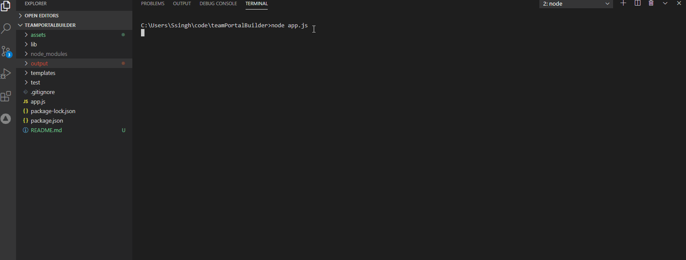

# teamPoratlBuilder

## Table of Contents

- [Description](#Description)
- [Installation](#Installation)
- [Usage](#Usage)
- [Credits](#Credits)
- [License](#License)
- [Contributing](#Contributing)
- [Tests](#Tests)
- [Questions](#Questions)

## Description

A utility for a team's manager to generate a Web page for their team. The generated Web page contains basic information about the team members. The Information is collected from the user in the command-line.
The manager is prompted to provide their's and the team member's information. The manaer may add as many team members as they want.
The utility **automatically** assigns an ID to each team member.

## Installation

- run npm install
- run node ./app.js

## Usage

run node./app.js and follow the prompts on your screen. Your team.html file will be placed in the 'output' directory.

## Credits

sandyboon(https://github.com/sandyboon)

## License

Licensed under the MIT license.

## Contributing

Contribution to this project is not permitted at this moment.

## Tests

The tests are in the test folder. You can run the test by using the command - <code>npm run test</code>.

## Questions

Please email me your questions at sandy.boon@gmail.com. I will get back to you as soon as possible. Thank you!
